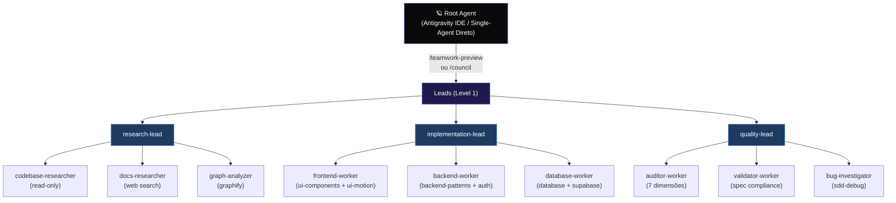

# 🏛️ Antigravity v6 Architecture — Hierarchical Multi-Agent & agy Hybrid

## 1. Visão Geral

A arquitetura do Antigravity Config v6 introduz uma estrutura hierárquica de agentes com 2 níveis de profundidade (Leads e Workers), integração híbrida com o `agy CLI` como executor primário headless, e fallback automático para subagentes nativos do Antigravity 2.0.



## 2. Princípios Fundamentais

1. **Single-Agent Direto como Default:** A delegação para subagentes é opt-in, ativada somente quando explicitamente solicitado (`/teamwork-preview`, `/council`).
2. **Monopólio do Root:** Somente o Root Agent pode realizar commits Git, empurrar para o remoto (`git push`), editar `spec-plan.md` ou escrever nas memórias `.agent/memory/`.
3. **Leads Não Escrevem Código:** Leads apenas planejam, coordenam e consolidam resultados de workers. `enable_write_tools = false`.
4. **Workers Especializados:** Workers executam tarefas com restrições rígidas (budget de no máximo 10 tool calls, timeout de 5 minutos).
5. **agy Primário com Fallback Nativo:** Toda invocação tenta primeiro o `agy CLI` em processo headless; em caso de erro, timeout ou ausência do CLI, ocorre fallback automático para o motor de subagentes nativo do Antigravity 2.0.

## 3. Matriz de Permissões e Responsabilidades

| Agente | Nível | Subagent Tools | Write Tools | Skills Associadas | Ação Permitida |
|---|---|---|---|---|---|
| `Root Agent` | 0 | Sim | Sim | Todas | Git commit, push, archive, decisões |
| `research-lead` | 1 | Sim | Não | `obsidian`, `adaptive-reasoning` | Coordena pesquisa paralela |
| `implementation-lead` | 1 | Sim | Não | `sdd-apply` | Coordena implementação por domínio |
| `quality-lead` | 1 | Sim | Não | `sdd-archive`, `adaptive-reasoning` | Coordena auditorias e validações |
| `codebase-researcher` | 2 | Não | Não | `obsidian` | Leitura de código, AST Skeleton |
| `docs-researcher` | 2 | Não | Não | `obsidian` | Busca web, documentações |
| `graph-analyzer` | 2 | Não | Não | `graphify-windows` | Grafo de dependências |
| `frontend-worker` | 2 | Não | Sim | `ui-components`, `ui-motion` | Componentes React/Tailwind/UI |
| `backend-worker` | 2 | Não | Sim | `backend-patterns`, `auth` | Server Actions, validação Zod |
| `database-worker` | 2 | Não | Sim | `database`, `supabase` | Schemas DDL, migrations, RLS |
| `auditor-worker` | 2 | Não | Não | `deploy-production` | Auditoria em 7 dimensões |
| `validator-worker` | 2 | Não | Não | `sdd-proposal` | Validação de especificações |
| `bug-investigator` | 2 | Não | Sim | `sdd-debug` | Diagnóstico e correções cirúrgicas |

## 4. Ciclo de Vida com Fallback Chain

```
[Invocação de Tarefa pelo Lead]
             │
             ▼
   [Verificar agy CLI]
      │             │
  (presente)    (ausente)
      │             │
      ▼             │
[spawn-agy-worker.ps1]
      │
      ├─ Sucesso (JSON) ──► [Consolidar no Lead]
      │
      └─ Falha/Timeout ──► [Fallback Nativo: invoke_subagent]
                                     │
                                     ├─ Sucesso ──► [Consolidar no Lead]
                                     └─ Falha ────► [Alerta FAILED ao Root]
```
