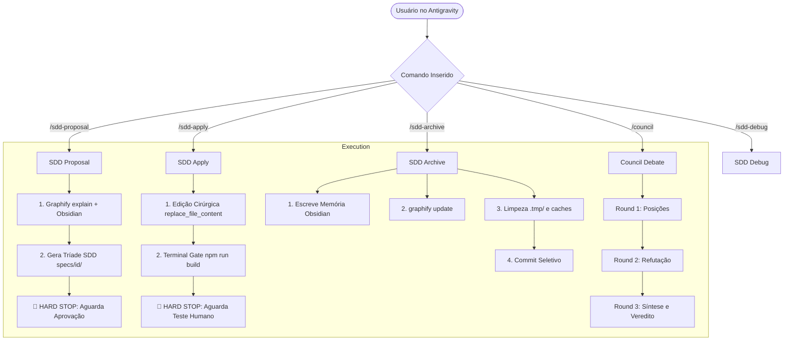

# 📐 Design: Especificação Técnica da Unificação de Workflows & Manual

## 1. Arquitetura de Fluxo Ponta a Ponta

## 2. Estrutura do Manual de Operação (`docs/manual-operacao-antigravity.md`)
O manual deve cobrir 6 seções canônicas:
1. **Fundamentos do Antigravity 2.0:** Single-Agent Direto, eliminação do Waffling, governança por ferramentas.
2. **Ciclo SDD Passo a Passo:** O contrato inviolável dos Hard Stops, como usar cada slash command e quando parar.
3. **Uso da Inteligência Topológica (Graphify):** Como inspecionar dependências com `graphify explain` e manter o grafo atualizado com `graphify update`.
4. **Design System & Controle Dark Semântico:** Tabela de tokens do `DESIGN.md`, regra do `globals.css` e como escurecer o app inteiro para preto absoluto sem quebrar cards.
5. **Debate do Conselho (`/council`):** Quando chamar o conselho de 4 personas e como ler a síntese final.
6. **Prevenção de Regressões e Conflitos:** Regras de ouro para nunca mais quebrar código antigo (Blast Radius e Fast Rollback).

## 3. Interfaces & Contratos de Governança
- **Precedência de Regras:** `~/.gemini/config/rules/ia.md` (Global) -> `.agent/rules/ia.md` (Local) -> `DESIGN.md` (Visual).
- **Semântica de Aliases:**
  - `/vibe-proposal` é alias estrito para `/sdd-proposal`.
  - `/vibe-apply` é alias estrito para `/sdd-apply`.
  - `/vibe-archive` é alias estrito para `/sdd-archive`.
  - `/vibe-debug` é alias estrito para `/sdd-debug`.

## 4. Cenários Obrigatórios

### Happy Path (Fluxo Nominal)
1. Usuário digita `/sdd-proposal <feature>`. O agente inspeciona o grafo com Graphify, consulta Obsidian, cria a pasta `specs/<feature>/` com os 3 arquivos e para (Hard Stop).
2. Usuário digita `/sdd-apply <feature>`. O agente altera cirurgicamente os arquivos alvo, roda `npm run build` no terminal com sucesso e para para teste visual do usuário.
3. Usuário digita `/sdd-archive <feature>`. O agente limpa `.tmp/`, roda `graphify update`, salva a lição em `.agent/memory/` e faz commit seletivo.

### Edge Case (Falha de Compilação no Apply)
1. Durante o `/sdd-apply`, o comando `npm run build` falha.
2. **Ação Mandatória:** O agente NÃO comita nem cria código sobre código. Ele executa rollback imediato do bloco alterado, analisa a causa raiz e tenta até 3 abordagens isoladas. Se persistir, para e reporta o log forense ao usuário.

## 5. Critérios de Aceitação Verificáveis
- [ ] Manual `docs/manual-operacao-antigravity.md` criado com todas as 6 seções completas, sem placeholders.
- [ ] `README.md` do repositório raiz atualizado com referência direta ao manual e arquitetura v7.
- [ ] Script de deploy `scripts/deploy-to-projects.ps1` atualizado para propagar a pasta `docs/` e `specs/global/features.md`.
- [ ] Todos os 19 projetos em `scratch/` sincronizados sem erros de execução.

## 6. Dois Cenários de Teste (SCAN -> INFER -> VERIFY -> FIX)
- **Cenário 1 (Anti-Duplicação):** SCAN nas 11 skills ativas -> INFER que nenhuma skill duplica funcionalidade existente -> VERIFY que `INDEX.md` mapeia apenas as 11 canônicas -> FIX se houver apontamento para skill morta.
- **Cenário 2 (Deploy Sem Resíduos):** SCAN nos alvos de deploy -> INFER que `.tmp/` e dumps JSON não sobem no espelhamento -> VERIFY execução com `$failCount == 0` -> FIX se algum projeto acusar falha de permissão.