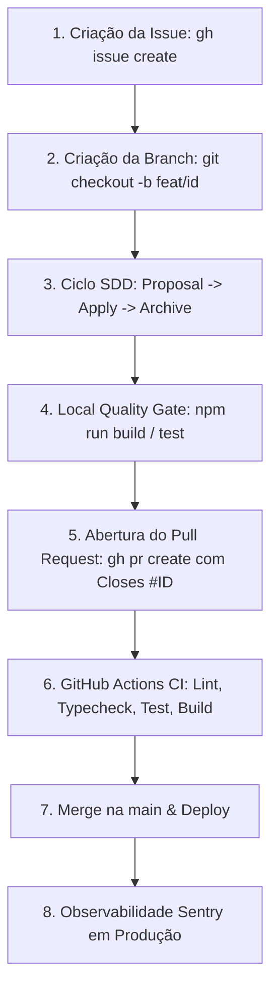

# 📐 Design: Especificação Técnica de GitHub Flow, Motion UI e Observabilidade

## 1. Arquitetura de Fluxo do Ciclo de Engenharia



---

## 2. Padrões Técnicos e Snippets Canônicos

### A. GitHub Flow (Issues & PRs com `gh` CLI)

#### 1. Criação Automatizada de Issue:
```bash
gh issue create \
  --title "feat(clientes): adicionar reativação automática de clientes inativos" \
  --body "## Objetivo`n`nCriar fluxo para identificar clientes sem interação há mais de 30 dias e disparar mensagem.`n`n## Critérios de Aceite`n- [ ] Clientes < 30 dias ignorados`n- [ ] Mensagens duplicadas bloqueadas`n- [ ] Envio registrado no banco"
```

#### 2. Template de Pull Request Obrigatório (`.github/PULL_REQUEST_TEMPLATE.md`):
```markdown
## Resumo
[Breve descrição do que este Pull Request implementa ou corrige]

## Issue Relacionada
Closes #[ID_DA_ISSUE]

## Alterações
- [Item 1 alterado/adicionado]
- [Item 2 alterado/adicionado]

## Testes Realizados
- [ ] Testes unitários executados e passando
- [ ] Build e checagem de tipos sem erros
- [ ] Teste manual de tela ou rota verificado
```

#### 3. Comando para Abertura do PR:
```bash
gh pr create \
  --title "feat(clientes): adicionar reativação automática de clientes inativos" \
  --body-file .github/pr_body_temp.md \
  --base main \
  --head feature/reativacao-clientes
```

---

### B. Motion Engineering & Micro-UX (Padrão Skill Motion / Rauno)

#### 1. Skeleton Loading Obrigatório em Estados Assíncronos:
```tsx
export function CustomerView({ isLoading, customers }) {
  if (isLoading) {
    return <CustomerListSkeleton count={4} />;
  }
  
  if (!customers || customers.length === 0) {
    return <EmptyState title="Nenhum cliente inativo" description="Todos os clientes estão engajados." />;
  }

  return (
    <div className="grid gap-3">
      {customers.map((c) => (
        <CustomerCard key={c.id} customer={c} />
      ))}
    </div>
  );
}
```

#### 2. Animação de Entrada e Saída (240ms GPU Only):
```css
/* Entrada suave */
.motion-card-enter {
  animation: slideIn 240ms ease-out forwards;
}

@keyframes slideIn {
  from {
    opacity: 0;
    transform: translateY(8px);
  }
  to {
    opacity: 1;
    transform: translateY(0);
  }
}

/* Saída suave antes da remoção */
.motion-card-exit {
  animation: slideOut 200ms ease-in forwards;
}

@keyframes slideOut {
  from {
    opacity: 1;
    transform: scale(1);
  }
  to {
    opacity: 0;
    transform: scale(0.96);
  }
}
```

---

### C. Observabilidade com Sentry (Breadcrumbs + Contextual Capture)

Toda operação crítica de negócio (campanhas, pagamentos, mutações no banco) deve emitir breadcrumbs estruturados:

```typescript
import * as Sentry from "@sentry/nextjs";

export async function processCustomerReactivation(campaignId: string, customerCount: number) {
  // 1. Breadcrumb estruturado antes de iniciar a operação
  Sentry.addBreadcrumb({
    category: "campaign",
    message: "Iniciando campanha de reativação",
    level: "info",
    data: {
      campaignId,
      customerCount,
      timestamp: new Date().toISOString(),
    },
  });

  try {
    const result = await sendCampaign(campaignId);
    return { success: true, result };
  } catch (error) {
    // 2. Captura contextual em caso de erro com tags de busca e extras seguros
    Sentry.captureException(error, {
      tags: {
        feature: "customer-reactivation",
        campaignId,
      },
      extra: {
        customerCount,
      },
    });

    throw error;
  }
}
```

---

### D. Pipeline de Qualidade no GitHub Actions (`.github/workflows/quality.yml`)

```yaml
name: Quality & Release Gate

on:
  pull_request:
    branches: [main]

jobs:
  quality:
    name: Lint, Typecheck & Tests
    runs-on: ubuntu-latest
    timeout-minutes: 10

    steps:
      - uses: actions/checkout@v4

      - name: Setup Node.js / Bun
        uses: oven-sh/setup-bun@v2
        with:
          bun-version: latest

      - name: Install dependencies
        run: bun install --frozen-lockfile

      - name: Linter & Code Style
        run: bun run lint

      - name: Typecheck
        run: bun run typecheck

      - name: Unit Tests
        run: bun run test

      - name: Build Verification
        run: bun run build
```

---

## 3. Cenários Obrigatórios

### Happy Path (Fluxo de Desenvolvimento Completo)
1. Agente ou dev abre issue: `gh issue create`.
2. Cria branch associada: `git checkout -b feat/reativacao-42`.
3. Executa o ciclo SDD (`proposal` -> `apply` com skeletons e Sentry -> `archive`).
4. Abre Pull Request via `gh pr create` contendo `Closes #42`.
5. GitHub Actions roda o `quality.yml` (passando lint, typecheck e build em < 2 min).
6. Merge realizado e issue fechada automaticamente.

### Edge Case (Falha de Operação Assíncrona com Telemetria)
1. Durante o envio de uma campanha, a API do webhook ou Supabase retorna timeout.
2. **Ação:** O Sentry captura a falha com os breadcrumbs de início da campanha e a tag `feature: customer-reactivation`, alertando a equipe antes do cliente reportar. Na interface, o componente transiciona suavemente para o estado de erro sem quebrar a tela.

---

## 4. Critérios de Aceitação Verificáveis
- [ ] PR Template criado em `.github/PULL_REQUEST_TEMPLATE.md`.
- [ ] Template de CI criado em `.github/workflows/quality.yml.example`.
- [ ] `skills/github-ops/SKILL.md` atualizado com fluxo de Issues e PRs com `Closes #ID`.
- [ ] `skills/ui-motion/SKILL.md` atualizado com padrões de Skeleton e Animação de Saída.
- [ ] `docs/manual-operacao-antigravity.md` enriquecido com a nova seção de GitHub Flow, Observabilidade Sentry e Motion.
- [ ] `specs/global/features.md` atualizado com o registro dos novos padrões.

---

## 5. Dois Cenários de Teste (SCAN -> INFER -> VERIFY -> FIX)
- **Cenário 1 (Validação de Templates):** SCAN nos arquivos em `.github/` -> INFER que o template contém a menção `Closes #` -> VERIFY com regex -> FIX se o formato divergir do GitHub padrão.
- **Cenário 2 (Propagação Multi-Projetos):** SCAN em `deploy-to-projects.ps1` -> INFER que `.github/` templates serão propagados -> VERIFY execução do script -> FIX se algum projeto não receber os templates.